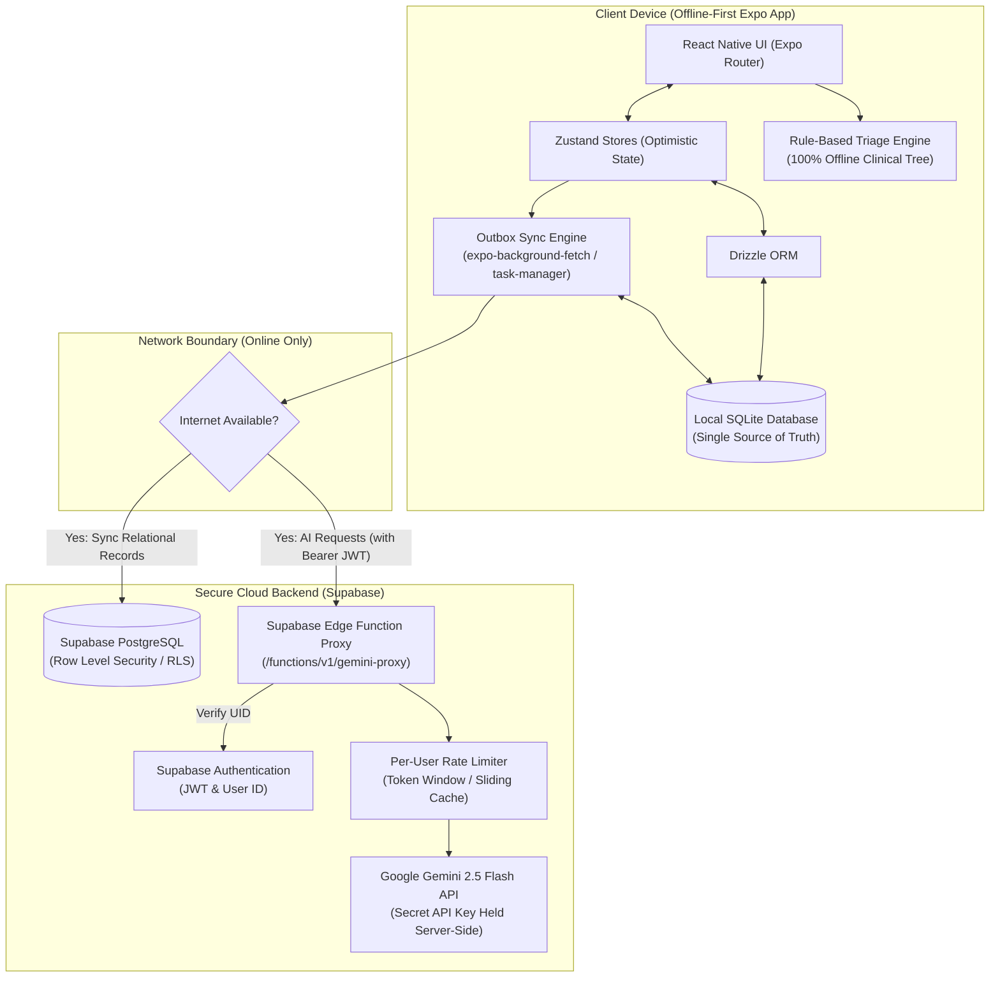
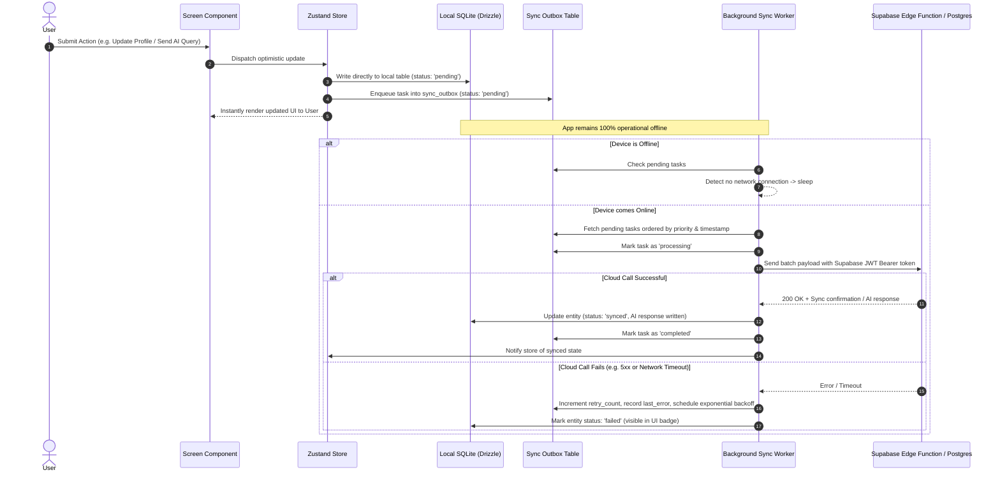

# Medi Bud — System Architecture & Data Flow

This document details the offline-first mobile architecture, data flow, synchronization patterns, and cloud security design for Medi Bud.

---

## 1. High-Level System Architecture

---

## 2. Synchronization & Outbox Flow (Eventual Consistency)

The app utilizes an **Outbox Pattern** to ensure zero data loss during intermittent or absent connectivity.

---

## 3. Data Storage & Schema Design

### Local SQLite Database (`expo-sqlite` + `drizzle-orm`)
The local SQLite database contains all application data needed for offline operation:

| Table | Purpose | Offline Read/Write |
|---|---|---|
| `profiles` | Multi-profile family records under an account (`accountId`, `name`, `relationship`, `age`, ...) | Reads & Writes local-first; queued to outbox |
| `symptom_evaluations` | Offline triage results and online AI elaborations (scoped to `profileId`) | Offline rule evaluation; cached locally |
| `conversations` | AI chat session metadata (scoped to `profileId`) | Created and read offline |
| `chat_messages` | Chat messages with structured health cards | Saved offline; pending queries queued to outbox |
| `reminders` | Local medication schedules & adherence logs (scoped to `profileId`) | Managed 100% offline with local notifications |
| `sync_outbox` | Eventual consistency task queue | Enqueued locally, drained when online |

### Cloud Supabase PostgreSQL Structure
PostgreSQL naturally mirrors the local relational schema without NoSQL translation impedance:

- `profiles` (`id`, `account_id`, `name`, `relationship`, `age`, `gender`, `height_cm`, `weight_kg`, `health_issues`, `medications`, `allergies`, `updated_at`)
- `conversations` (`id`, `account_id`, `profile_id`, `title`, `created_at`, `updated_at`)
- `chat_messages` (`id`, `conversation_id`, `role`, `content`, `cards_json`, `interactive_json`, `image_uri`, `source`, `is_offline`, `created_at`)
- `reminders` (`id`, `account_id`, `profile_id`, `name`, `dosage`, `frequency`, `time`, `active`, `created_at`)
- `symptom_evaluations` (`id`, `account_id`, `profile_id`, `symptoms_json`, `urgency`, `advice`, `red_flags_detected`, `created_at`)

---

## 4. Security & Privacy Architecture

1. **Zero Client Secrets**:
   - The client application contains neither `GEMINI_API_KEY` nor any database master key.
   - External AI requests route through the Supabase Edge Function proxy, which authenticates the user's Supabase JWT.

2. **Per-User Rate Limiting**:
   - The Edge Function implements sliding-window rate limiting keyed by authenticated `account_id` (e.g. max 30 queries per 15 minutes).

3. **Row Level Security (RLS)**:
   - Tables enforce `auth.uid() = account_id` directly in PostgreSQL, mathematically preventing cross-user data exposure.
