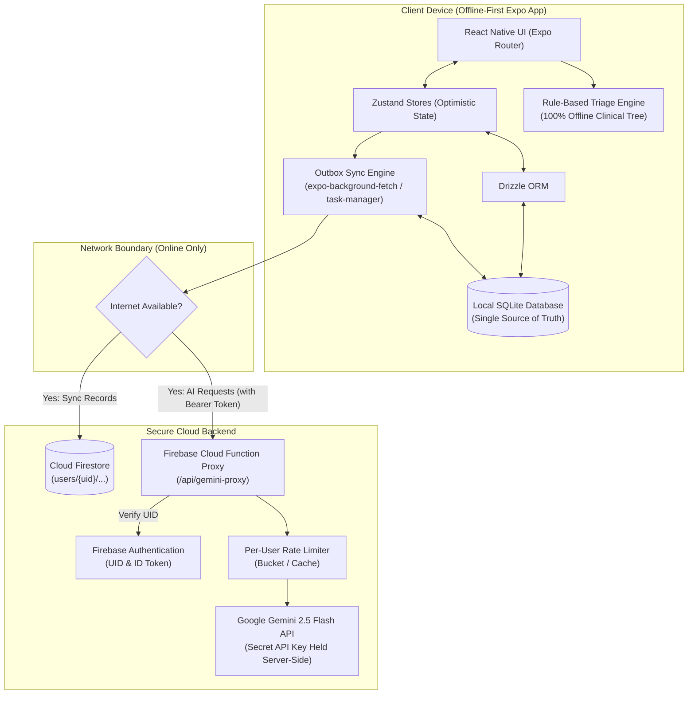
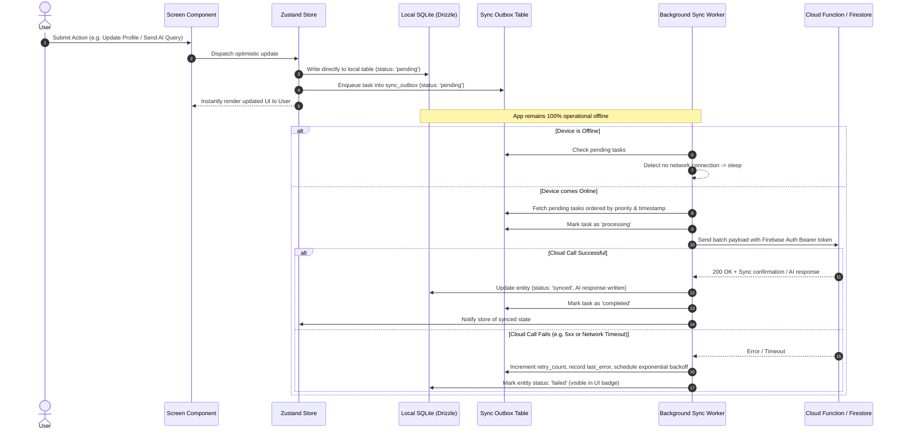

# Medi Bud — System Architecture & Data Flow

This document details the offline-first mobile architecture, data flow, synchronization patterns, and cloud security design for Medi Bud.

---

## 1. High-Level System Architecture



---

## 2. Synchronization & Outbox Flow (Eventual Consistency)

The app utilizes an **Outbox Pattern** to ensure zero data loss during intermittent or absent connectivity.



---

## 3. Data Storage & Schema Design

### Local SQLite Database (`expo-sqlite` + `drizzle-orm`)
The local SQLite database contains all application data needed for offline operation:

| Table | Purpose | Offline Read/Write |
|---|---|---|
| `profiles` | User demographics, conditions, medications, allergies | Reads & Writes local-first; queued to outbox |
| `symptom_evaluations` | Offline triage results and online AI elaborations | Offline rule evaluation; cached locally |
| `conversations` | AI chat session metadata | Created and read offline |
| `messages` | Chat messages with structured health cards | Saved offline; pending queries queued to outbox |
| `medication_reminders` | Local medication schedules & adherence logs | Managed 100% offline with local notifications |
| `sync_outbox` | Eventual consistency task queue | Enqueued locally, drained when online |

### Cloud Firestore Structure (`@react-native-firebase/firestore`)
Firestore mirrors the local database for multi-device sync and backup. It is **never** accessed as a blocking read prerequisite for the client UI:

```
users/
  └── {userId}/
        ├── profile/
        │     └── main (demographics, health issues, medications, allergies)
        ├── symptom_history/
        │     └── {evalId} (symptoms, triage urgency, causes, advice)
        ├── conversations/
        │     └── {convId} (title, timestamps)
        │           └── messages/
        │                 └── {messageId} (role, content, cards)
        └── reminders/
              └── {reminderId} (name, dosage, times, active)
```

---

## 4. Security & Privacy Architecture

1. **Zero Client Secrets**:
   - The client application contains neither `GEMINI_API_KEY` nor any privileged administrative credentials.
   - All external AI requests route through the Firebase Cloud Function proxy, which authenticates the user's Firebase ID token via the Firebase Admin SDK.

2. **Per-User Rate Limiting**:
   - The Cloud Function implements token-bucket or window-based rate limiting keyed by `request.auth.uid` (e.g. max 30 queries per hour per user).
   - Protects server resources and costs against automated abuse or compromised devices.

3. **Firestore Security Rules**:
   - Direct access to `users/{userId}` is strictly gated:
     ```javascript
     rules_version = '2';
     service cloud.firestore {
       match /databases/{database}/documents {
         match /users/{userId}/{document=**} {
           allow read, write: if request.auth != null && request.auth.uid == userId;
         }
       }
     }
     ```
   - Cross-user data leakage is impossible at the database level.
